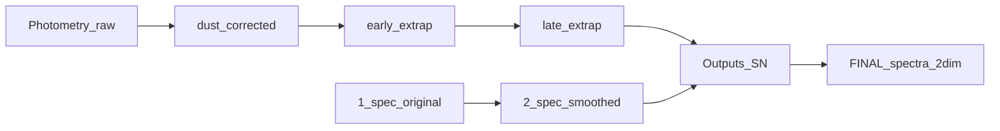

# KN pipeline review (log / newlog track)

This document describes the kilonova (KN) processing chain under [`Codes/`](.), including inputs, outputs, imports, and how notebooks connect. Paths are expressed relative to **`COCO_PATH`** (repository root containing `Inputs/` and `Outputs/`).

---

## Current workflow notes (operator)

- **Late-time extension (notebook 3) is not used in the current workflow.** Notebook 2 writes to `Inputs/Photometry/3_LCs_early_extrapolated/`. For light curves, the file produced there is **copied** (or treated as the source of truth) into **`Inputs/Photometry/4_LCs_late_extrapolated/`** so that [**`4_LCfit_KN_log.ipynb`**](4_LCfit_KN_log.ipynb) can run without running [**`3_LC_modelExpDecay_KN.ipynb`**](3_LC_modelExpDecay_KN.ipynb). Notebook 3 remains in the repo as an optional exponential-decay extension step.

- **Spectroscopy** starts with [**`0.1_Smooth_spectra_KN.ipynb`**](0.1_Smooth_spectra_KN.ipynb) before the photometry-heavy steps that consume `2_spec_lists_smoothed/`.

---

## Scope and numbering

| Step | Notebook | Notes |
|------|----------|--------|
| 0.1 | [`0.1_Smooth_spectra_KN.ipynb`](0.1_Smooth_spectra_KN.ipynb) | Smooth spectra; mask/remove galaxy and sky lines; build smoothed lists. |
| 1 | [`1_LC_DustCorrection_KN.ipynb`](1_LC_DustCorrection_KN.ipynb) | Single variant. |
| 2 | [`2_LC_modelRising_KN_fullfit_log.ipynb`](2_LC_modelRising_KN_fullfit_log.ipynb) | Early-time LC extrapolation (log-aware fullfit). |
| 3 | [`3_LC_modelExpDecay_KN.ipynb`](3_LC_modelExpDecay_KN.ipynb) | *Optional; skipped in current workflow* — see note above. |
| 4 | [`4_LCfit_KN_log.ipynb`](4_LCfit_KN_log.ipynb) | GP LC fit in log space; feeds Outputs. |
| 5 | [`5_Mangle_spectra_KN_log.ipynb`](5_Mangle_spectra_KN_log.ipynb) | Mangle in log λ / log F space. |
| 6 | [`6_TwoDim_UVExtend_Extrapolate_KN_newlog.ipynb`](6_TwoDim_UVExtend_Extrapolate_KN_newlog.ipynb) | 2D GP via [`GP2dim_utils_newlog.py`](GP2dim_utils_newlog.py). Alternate: [`6_TwoDim_UVExtend_Extrapolate_KN_log.ipynb`](6_TwoDim_UVExtend_Extrapolate_KN_log.ipynb) uses `GP2dim_utils`. |
| 7 | [`7_Rimangle_KN_log.ipynb`](7_Rimangle_KN_log.ipynb) | Re-mangle + FINAL products; [`rimangle_log_spectrum.py`](rimangle_log_spectrum.py). |
| 7.5 | [`7.5_comparison_check_log.ipynb`](7.5_comparison_check_log.ipynb) | Validation vs photometry and spectra; [`comparison_check_log_utils.py`](comparison_check_log_utils.py). |

There is no KN **`0_toFlux`** notebook in this tree; [`SN_pipeline/0_toFlux_SN.ipynb`](SN_pipeline/0_toFlux_SN.ipynb) is SN-oriented and marked not for KN.

---

## Data flow (high level)



**Photometry folders (`Inputs/Photometry/`):**

1. `1_LCs_flux_raw/`
2. `2_LCs_dust_corrected/`
3. `3_LCs_early_extrapolated/` (notebook 2 output)
4. `4_LCs_late_extrapolated/` (notebook 3 output *or* copy from step 3 when SKipping NB3)

**Spectroscopy (`Inputs/Spectroscopy/`):** `1_spec_original/`, `1_spec_lists_original/`, `2_spec_smoothed/`, `2_spec_lists_smoothed/` (see 0.1).

**Per-object outputs:** `Outputs/<SN>/` (fitted LCs, `mangled_spectra/`, `TwoDextended_spectra/`, `RE_mangled_spectra_*`, `FINAL_spectra_*`, etc.).

---

## Step-by-step

### 0.1 — Smooth spectra ([`0.1_Smooth_spectra_KN.ipynb`](0.1_Smooth_spectra_KN.ipynb))

**Purpose:** Smooth per-epoch spectra, suppress galaxy emission lines (with exception logic for Hα in IIn-type cases), and remove telluric/sky lines where not already removed. Produce **smoothed** spectra and a **smoothed spectrum list** consumed by later notebooks (e.g. `2_spec_lists_smoothed/<SN>.list`).

**Imports / tools:** `numpy`, `pandas`, `matplotlib`, `sklearn`, `astropy` (`fits`, `units`), `scipy.signal`, `scipy.stats.norm`, `os`.

**Inputs:**

- `DATASPEC_PATH` → `Inputs/Spectroscopy/`
- `DATAINFO_PATH` → `Inputs/SNe_Info/`
- `FILTER_PATH` → `Inputs/Filters/`
- **Original spectra:** `Inputs/Spectroscopy/1_spec_original/`
- **Original lists:** `Inputs/Spectroscopy/1_spec_lists_original/<SN>.list`

**Processing (conceptual):** Class-based workflow loads the object list, reads each original spectrum, applies smoothing and line masks (wavelength constants for narrow lines, sky lines, etc.), writes smoothed arrays and diagnostic PNGs.

**Outputs:**

- **Smoothed data:** `Inputs/Spectroscopy/2_spec_smoothed/<SN>/` — multi-column text spectra (`#wls`, flux, flux_err).
- **Smoothed list:** `Inputs/Spectroscopy/2_spec_lists_smoothed/<SN>.list` — lines with MJD, phase-like second column, and relative path to the smoothed file.

---

### 1 — Dust correction ([`1_LC_DustCorrection_KN.ipynb`](1_LC_DustCorrection_KN.ipynb))

**Purpose:** Correct broadband photometry for Milky Way + host extinction when needed.

**Imports / tools:** `numpy`, `pandas`, `os`, `sys`, **`what_the_flux`** for filter loading.

**Inputs:** `Inputs/Photometry/1_LCs_flux_raw/`, `Inputs/SNe_Info/info.dat`, `Inputs/Filters/` (e.g. `GeneralFilters/`, `Swift/`).

**Outputs:** `Inputs/Photometry/2_LCs_dust_corrected/<SN>.dat` (`to_csv`).

---

### 2 — Early-time rising extrapolation ([`2_LC_modelRising_KN_fullfit_log.ipynb`](2_LC_modelRising_KN_fullfit_log.ipynb))

**Purpose:** Extrapolate or constrain LCs at early times; uses **`2_spec_lists_smoothed/<SN>.list`** for spectroscopic anchoring.

**Imports / tools:** `numpy`, `pandas`, `matplotlib`, `scipy.optimize`, **`george`**, **`emcee`**, **`what_the_flux`**, etc.

**Inputs:** `Inputs/Photometry/2_LCs_dust_corrected/`, `Inputs/Spectroscopy/` (smoothed lists), `Inputs/SNe_Info/`, `Inputs/Filters/`.

**Outputs:** `Inputs/Photometry/3_LCs_early_extrapolated/<SN>.dat`.

---

### 3 — Late-time exponential tail ([`3_LC_modelExpDecay_KN.ipynb`](3_LC_modelExpDecay_KN.ipynb)) — optional

**Purpose (if run):** Extend LCs at late phases with an exponential decay model.

**Inputs:** `Inputs/Photometry/3_LCs_early_extrapolated/`.

**Outputs (if run):** `Inputs/Photometry/4_LCs_late_extrapolated/<SN>.dat`.

**Current workflow:** This step is **not run**. The team **copies** (or symlinks) the notebook-2 product into **`4_LCs_late_extrapolated/`** so notebook 4 reads the same LC file from the “late” folder location without late-tail modeling.

---

### 4 — GP light-curve fit, log space ([`4_LCfit_KN_log.ipynb`](4_LCfit_KN_log.ipynb))

**Purpose:** Multi-band GP fits in log space; outputs tables for mangling and downstream 2D work.

**Imports / tools:** **`george`**, `numpy`, `pandas`, `matplotlib`, `scipy`, **`what_the_flux`**, `csv`.

**Inputs:** `Inputs/Photometry/4_LCs_late_extrapolated/`, `2_spec_lists_smoothed/<SN>.list`.

**Outputs (`Outputs/<SN>/`):** `fitted_phot4mangling_<SN>.dat`, `fitted_phot_logspace_<SN>.dat`.

---

### 5 — Mangle spectra, log-native ([`5_Mangle_spectra_KN_log.ipynb`](5_Mangle_spectra_KN_log.ipynb))

**Purpose:** Adjust smoothed spectra to match GP photometry; stores **log₁₀ λ** and **log₁₀ Fλ** for NB6 newlog.

**Imports / tools:** `numpy`, `pandas`, `matplotlib`, `scipy`, **`george`**, `astropy.io.fits`, `json`, **`what_the_flux`**.

**Inputs:** `Outputs/<SN>/fitted_phot4mangling_*.dat`, spectra under Inputs/Outputs per class, filter curves.

**Outputs:** `Outputs/<SN>/mangled_spectra/*.txt`, diagnostic PDFs.

---

### 6 — 2D GP extrapolation ([`6_TwoDim_UVExtend_Extrapolate_KN_newlog.ipynb`](6_TwoDim_UVExtend_Extrapolate_KN_newlog.ipynb))

**Purpose:** 2D GP on log wavelength × log phase; UV extension and gap fill via [`GP2dim_utils_newlog.py`](GP2dim_utils_newlog.py).

**Imports / tools:** **`GP2dim_utils_newlog`**, `george`, `numpy`, `pandas`, `matplotlib`, `scipy`.

**Inputs:** `Outputs/<SN>/mangled_spectra/`, `fitted_phot_logspace_*.dat`, `fitted_phot4mangling_*.dat`, `Inputs/Photometry/4_LCs_late_extrapolated/`, `Inputs/2DIM_priors/`.

**Outputs:** `Outputs/<SN>/TwoDextended_spectra/` (extended spectra, plots, grids per `save_plots_files`) or, when using the branched layout, `Outputs/<SN>/twodim/<extend|extrapolate>/` with `spliced/` and `full_gp/` (see implementation status table).

**Optional t₀-style 2D anchor:** `pipeline_config.GP_2D_ANCHOR_T0` (default **False**) and related `GP_2D_T0_ANCHOR_*` keys are copied onto the spec class in notebook **6**; [`GP2dim_utils_newlog.run_2DGP_GRID`](GP2dim_utils_newlog.py) may call [`augment_2dgp_training_t0_anchor`](GP2dim_utils_newlog.py) before `gp.compute`. Toggle **off** for legacy behavior; tune log-phase and flux cap when **on**.

---

### 7 — Re-mangle + FINAL ([`7_Rimangle_KN_log.ipynb`](7_Rimangle_KN_log.ipynb))

**Purpose:** Re-mangle extended spectra; write FINAL calibrated products (e.g. `FINAL_spectra_2dim/` with `as_observed/`, `HostNotCorr/`).

**Imports / tools:** **`rimangle_log_spectrum`**, `george`, `numpy`, `pandas`, `matplotlib`, `scipy`, `astropy`.

**Inputs:** `Outputs/<SN>/TwoDextended_spectra/`, `fitted_phot_logspace_*.dat` or `fitted_phot_*.dat`, **`FINAL_info.dat`** (see notebook error strings / PyCoCo layout).

**Outputs:** `RE_mangled_spectra_*`, `FINAL_spectra_*` trees under `Outputs/<SN>/`.

---

### 7.5 — Comparison / QA ([`7.5_comparison_check_log.ipynb`](7.5_comparison_check_log.ipynb))

**Purpose:** Compare FINAL SEDs to photometry (`synphot`) and to original / smoothed / mangled spectra (`comparison_check_log_utils`, including `read_final_spectrum_linear` for log-on-disk files).

**Dense grid → FINAL → 7.5:** When notebook **6** runs with dense log-phase prediction (`GP_PREDICT_DENSE_LOG_PHASE`) and notebook **7** writes the branched FINAL tree, set **`TWODIM_BRANCH`** in **7.5** (e.g. `extrapolate/full_gp`) so the lookup table includes every FINAL epoch (including closely spaced early-time rows).

**Imports / tools:** `synphot`, `astropy.units`, `matplotlib`, `numpy`, `pandas`, **`comparison_check_log_utils`**.

**Inputs:** `Outputs/<SN>/FINAL_spectra_2dim/` (flat or under `…/<extend|extrapolate>/<spliced|full_gp>/`), `Inputs/Photometry/4_LCs_late_extrapolated/`, spectroscopy folders as selected by comparison mode.

**Outputs:** Figures (diagnostic only).

**Optional explosion row for synphot / QA:** [`create_lookup_table`](comparison_check_log_utils.py) accepts **`prepend_explosion_mjd`** (and **`prepend_flux_floor_linear`**): if the earliest loaded spectrum is **strictly later** than that MJD, one synthetic faint constant row is prepended (use the same **`t0_fix`** idea as notebook **4**). The helper cell’s **`compare_lightcurves_mag(..., explosion_mjd_for_synphot=...)`** prepends via [`augment_spectra_list_explosion_mjd`](comparison_check_log_utils.py) when using **`spectra_list`**. **`smooth_syn_plot`** uses [`dense_plot_axis_log_days`](comparison_check_log_utils.py) for **display-only** log-time interpolation (markers remain true synphot epochs).

---

## External / shared code

- **`what_the_flux`:** notebooks 1–5 (filters, flux/mag).
- **`george`:** 1D GPs (2, 4, 5); 2D in NB6 via `GP2dim_utils_newlog`.
- **`emcee`:** notebook 2.
- **`synphot`:** notebook 7.5.
- **Local:** `GP2dim_utils_newlog.py`, `rimangle_log_spectrum.py`, `comparison_check_log_utils.py`.

---

*Generated for the PyCoCo_templates KN log pipeline; adjust `COCO_PATH` in each notebook to match your machine.*

---

## Pipeline audit and change plan (2026)

This section records **what was checked** in the codebase against your seven items and a **concrete implementation plan** (no code changes were made in this audit). **Suggested order** for future work: (7) MJD ranges from raw photometry + notebook 5 wiring → (3)/(5) dual products (spliced vs full GP) + output layout for extend vs extrapolate → (2) optional λ overrides → (4) explosion constraint with mangling guardrails → (6) jagged LCs → (1) large refactor last once behavior is frozen.

---

### 1. Pipeline cleanup (structure only, no science change)

**Review:** Running the pipeline requires stepping through many notebooks with duplicated `COCO_PATH`, `DATALC_PATH`, filter dicts, and large class definitions embedded in cells. Some helper `.py` files already exist (`GP2dim_utils_newlog.py`, `comparison_check_log_utils.py`, `rimangle_log_spectrum.py`); notebooks still duplicate a lot of configuration and UI.

**Plan:**

1. Add a small **`pipeline_config.py`** (or `kn_pipeline_paths.py`) under `Codes/` with: `COCO_PATH`, `SNNAME`, standard `Inputs/…` / `Outputs/…` paths, and any shared dicts (filter colors/markers). Notebooks import this and avoid re-pasting paths. Optionally support environment variable override for `COCO_PATH`.
2. Move **stable class bodies** from notebooks **5, 6, 7** into modules (e.g. `mangle_spectra_class.py`, `twodim_spec_class.py` or names you prefer); keep notebooks as **thin** drivers: set object, call methods, plot, choose filters interactively (especially notebook 2).
3. **Strip dead/duplicate cells** per notebook with a pass documented in git (commented “removed unused …” only where needed).
4. Add **module/class docstrings** and short **parameter tables** at the top of moved code; no algorithm changes.
5. Notebook 2: keep **interactive filter selection** in the notebook; move only the heavy lifting into importable functions.

---

### 2. Wavelength and time limits for the SED (blue/red and how far to predict)

**Review:**

- **7.5 / lookup table:** [`comparison_check_log_utils.py`](comparison_check_log_utils.py) `create_lookup_table(..., wavelength_range=None, wavelength_bins=10000)`. If `wavelength_range` is `None`, the common grid spans **min/max over all loaded FINAL spectra** (`np.linspace(wl_min, wl_max, wavelength_bins)`). To force coverage to ~2000 Å (UVOT), pass e.g. `wavelength_range=(2000.0, upper_Å)` when calling `create_lookup_table`. Plots that use that lookup inherit the same `common_wavelengths`.
- **2D GP prediction wavelengths:** [`GP2dim_utils_newlog.py`](GP2dim_utils_newlog.py) `run_2DGP_GRID` builds λ from **`GP2DIM_Class.grids[0]`** (log₁₀ Å from the training grid): `wls_min` / `wls_max` and steps controlled by `gp_predict_n_wavelength` (default 300), `gp_predict_wl_step` (default 0.01 in log₁₀ Å). There is **no single global “UV floor”**; the blue limit follows whatever rows exist on the 2D grid (UV synthetic rows, spectrum pixels, effective λ of bands).
- **Time / phase extent (notebook 6):** For `mode == 'extrapolate_spectra'`, `extend_grid_all_spectraltimeseries` uses **gap fill** (`extrapolate_gap_fill_days`, `extrapolate_gap_fill_cadence_days`), **early log-phase span** (`extrap_phot_early_span_dex`, default 1.5 dex), optional cap **`extrapolate_log_phase_span_dex`**, and extends to max LC log-phase. **These attributes are only applied in the `extrapolate_spectra` branch**, not in the full `extend_spectra` block (see item 5).

**Plan:**

1. **Default:** Keep current behavior: 2D GP prediction wavelengths follow the training grid / data (`GP2DIM_Class.grids[0]`, `gp_predict_*`); 7.5 lookup uses min/max over loaded spectra unless overridden.
2. **Optional manual range:** Introduce **`PIPELINE_WL_MIN_A`, `PIPELINE_WL_MAX_A`** (or `None` = auto) in shared config and thread them into: (a) optional clipping/extension of grid rows / prediction range in `GP2dim_utils_newlog` where safe; (b) `create_lookup_table(..., wavelength_range=...)` in 7.5; (c) wavelength-sweep plots as needed.
3. Document in one place how **time extent** is controlled (`extrapolate_log_phase_span_dex`, LC max phase, early span) and how **`extend_spectra` vs `extrapolate_spectra`** differ (see items 3 and 5 for saving both runs in labeled trees).

---

### 3. SED appears GP-smoothed at some λ and **exactly** matches input wiggles elsewhere

**Review (root cause in code):** In [`GP2dim_utils_newlog.py`](GP2dim_utils_newlog.py) **`save_plots_files`**, when `GP2DIM_Class.mode == 'extend_spectra'` and the phase matches a real spectrum (`phases_close` to a mangled epoch), the saved extended spectrum is a **concatenation**:

- **UV:** GP prediction for λ **below** the minimum λ of the mangled spectrum (`10**wls < min(wls_lin)`).
- **Interior:** **native mangled spectrum** `flx_lin` on `wls_lin` (linear Å), i.e. **the same pixels as the input mangled file**, not the GP mean — so every noise spike is reproduced.
- **IR:** GP prediction for λ **above** `max(wls_lin)` (`10**wls > max(wls_lin)`).

So the plot in 7.5 comparing FINAL / TwoDextended products to “smoothed” data can show **perfect wiggle matching** anywhere the saved product is still using the **interior splice** (not GP). This is **by construction**, not a bug in George “forgetting” to smooth. Your figure (smooth blueward, spike-matched redward) is consistent with: blue in GP-only UV extension; red in the wavelength range covered by the mangled/smoothed spectrum pixels used in the splice.

**Plan (dual products; no single “choice” required up front):**

1. **Save both versions in separate, clearly labeled directories** (names illustrative; pick constants in config):  
   - **`spliced` (or similar):** current behavior — interior = mangled spectrum, GP in UV/IR tails (and the same naming convention you use today for `*_spec_extended.txt` at spectrum epochs, if kept under this tree).  
   - **`full_gp` (or e.g. `gp_full`):** same phases / same λ grid where applicable, but **no interior splice** — use the **GP mean** (e.g. `smooth_ext_spec`) across the full prediction wavelength range (or document the exact definition if you blend at edges).
2. **`extrapolate_spectra` vs `extend_spectra`:** Support **running both modes** with outputs in **non-overlapping roots** so you can inspect them later (e.g. `Outputs/<SN>/twodim_extend/` vs `Outputs/<SN>/twodim_extrapolate/`, each containing `spliced/` and `full_gp/` subfolders — exact hierarchy TBD in implementation). **Defer** adding dense early-phase columns to **`extend_spectra`** until after you have a full **`extrapolate_spectra`** run to compare; the plan is **organizational first**, not to force densification into extend immediately.
3. **Downstream:** Notebook **7** (rimangle / FINAL writers) and any step that reads “extended” spectra should accept a **path tag** (or config) for **`spliced` vs `full_gp`** (and optionally **extend vs extrapolate** tree) so both chains can be produced without manual renaming.
4. **Notebook 7.5:** Extend [`comparison_check_log_utils.py`](comparison_check_log_utils.py) / notebook cells so you can **select which product tree** to use for full SED and spectrum comparisons (lookup table path, FINAL directory, labels in legends).
5. **Diagnostic:** Add a plot (notebook 6 and/or 7.5) **overlaying GP mean vs spliced** spectrum at spectrum epochs for quick visual QA.

---

### 4. Flux = 0 at explosion time (all wavelengths) through the pipeline

**Review:**

- **Notebook 2** ([`2_LC_modelRising_KN_fullfit_log.ipynb`](2_LC_modelRising_KN_fullfit_log.ipynb)): Multiple parametrizations exist; **forced-zero Bazin** (and similar) ties flux to **explosion date** for bands where that branch is used—not every filter path is identical.
- **Notebook 4** ([`4_LCfit_KN_log.ipynb`](4_LCfit_KN_log.ipynb)): Per-band GP in **log flux** vs **log phase**; `t0_fix` comes from `self.phot['MJD'][0] - self.phot['Phase'][0]`. There is **no explicit constraint** forcing log flux → −∞ (linear flux → 0) at phase = 0 / log phase → −∞ for every filter; predictions are driven by data + kernel + interpolated grid.
- **Notebook 6 / 7:** Inherit LC/surface behavior; 2D GP has no global “zero at t_explosion” prior unless you add it.

**Plan:**

1. **Single source of truth:** define `t0_explosion_mjd` (or phase zero) in shared config, aligned with notebook 2’s `explosion_dates` / Villar-style phase.
2. **Notebook 4 — two independent toggles (user choice):**
   - **(A) Pre-GP anchor (recommended for “the LC GP actually sees t₀”):** Optional boolean (e.g. `ANCHOR_T0_IN_LC_GP`, default off). When **on**, before `george.GP.compute(...)` in **`LCfit_withGP_xfilter`** ([`4_LCfit_KN_log.ipynb`](4_LCfit_KN_log.ipynb)), augment each band’s training **`Log_Phase`**, **log flux**, and **σ** with one synthetic point at explosion (e.g. `Log_Phase ≈ −8` or equivalent small linear-phase floor; `log₁₀(flux)` at a large negative cap; tunable `log_flux_err`). Reuse or mirror parameters from [`explosion_anchor_utils.py`](explosion_anchor_utils.py) so hyperparameters stay in one place. Mark these points in the same way as existing **SUDO** / mask conventions so plots show them distinctly and they are never confused with real detections.
   - **(B) Post-fit append to `fitted_phot_logspace` (2D-oriented / legacy workaround):** Keep the **existing** optional step: after the GP run and **after** building `fitted_phot_logspace_*.dat`, optionally call **`append_explosion_anchor_row`** so notebook **6** can see an extra early-time row **without** refitting notebook **4**. Default off; document that this **does not** change the 1D GP posterior used during `LCfit_withGP`.
   - **Recommendation:** Use **(A)** or **(B)**, not both at once, unless you explicitly want double anchoring and accept checking for consistency.
3. **Guardrail — do not treat pseudo points as real photometry:** Any step that **mangles** spectra or decides **which filter epochs are comparable to a spectrum MJD** must use **only real photometry** rows (e.g. from raw or a dedicated “observed only” table). Pseudo-observations used for GP anchoring must be **flagged or stored separately** so notebook **5** never includes them in `filter_mjd_dict` eligibility or “photometry near spectrum” logic (see item 7: MJD ranges from raw file only). **Pre-GP** anchors must **not** be written into raw LC files or `1_LCs_flux_raw`; they exist only in the temporary training vectors passed to `gp.compute` (and optionally in masks in `fitted_phot` diagnostics).
4. **Notebook 6 (optional, stronger):** Add **synthetic training points** at explosion phase (e.g. flux ≈ 0 at all λ rows) **only if** validation shows they do not distort the rest of the 2D surface—physically, the full spectrum should be zero at t₀. **Implemented:** toggle **`GP_2D_ANCHOR_T0`** in [`pipeline_config.py`](pipeline_config.py) (default **off**); see §6 and the implementation table.
5. **Regression check:** extract a light curve at phase → 0 from the FINAL / lookup table in 7.5 and assert it trends to zero within tolerance. **Partial QA:** optional **`prepend_explosion_mjd`** / **`explosion_mjd_for_synphot`** in **7.5** (synphot-oriented faint row at `t0_fix`, not a substitute for a full physical SED at t₀).

### 5. Early-time photometry in log phase [−3, −1] but GP predicts only at those times, not between (`extend_spectra`)

**Review:** In [`6_TwoDim_UVExtend_Extrapolate_KN_newlog.ipynb`](6_TwoDim_UVExtend_Extrapolate_KN_newlog.ipynb), the **dense** `mjds_extention`, `mjds_grid`, gap filling, and **`extrap_phot_times`** / `sparse_ok` logic that **spreads interpolated LC onto many time columns** lives inside **`if self.mode == 'extrapolate_spectra':`**. The notebook sets **`spec_class.mode = 'extend_spectra'`** at the end—so that entire branch may **not run**. For `extend_spectra`, **prediction epochs** in `run_2DGP_GRID` follow **`grid_ext.columns`** from `prepare_grid` / `extend_grid_all_spectraltimeseries`, which can be **sparse** (spectrum epochs ± UV rows) compared to the dense early grid you expected. Late times can still look “in between” if more columns exist there from the base grid.

**Plan:**

1. **Optional dense prediction phases (default off):** In [`GP2dim_utils_newlog.run_2DGP_GRID`](GP2dim_utils_newlog.py), if **`GP_PREDICT_DENSE_LOG_PHASE`** (via `pipeline_config` / notebook **6** on the spec class) is **on**, merge into **`extrap_mjds`** a vector of **`N`** samples evenly spaced in **log₁₀(phase days)** between the current column **min** and **max**, using **`numpy.logspace`** on linear days (equivalently **`np.linspace`** in log₁₀ phase). **Union + sort + unique** so **no** spectrum / photometry / gap-fill phase is removed—only **prediction** epochs increase. When the flag is **off**, behavior matches the legacy pipeline.
2. **Run both modes; separate outputs:** Execute **`extend_spectra`** and **`extrapolate_spectra`** with clearly separated output directory roots (paired with item 3’s **`spliced/` vs `full_gp/`** under each), so you can compare products. **Note:** sparse early-time **striping** in plots is addressed by item **1**, not by notebook **4** t₀ anchors (those change LC rows, not the 2D **column** list).
3. **`log_prediction_phase_coverage`:** Already prints counts in [−3, −1]; when dense merge is on, **`run_2DGP_GRID`** logs before/after counts for the same bracket.

---

### 6. Jagged light curves at late times (~1 day+)

**Review:** Likely contributors: **Matern 32 kernel length scales** (`kernel_wls_scale`, `kernel_time_scale` in `run_2DGP_GRID`), **no or small jitter** in `george.GP`, **very dense training grid** (encouraging interpolation through points), and **hard splice** / exact photometry constraints. Noise in log flux at late times also tightens the posterior around observations.

**Plan:**

1. Expose kernel hyperparameters and optional **`white_noise`** / jitter on `george.GP` in one config dict; document recommended ranges for “smoother” vs “faithful” fits.
2. **Ablation:** temporarily inflate `yerr` for late-time grid cells or subsample training times (science decision) to test jaggedness.
3. Compare predictive variance: if posterior variance is tiny between points, kernel is effectively interpolating—**increase** characteristic length in **time** (and λ if needed).
4. Revisit item 3: interior splice forces non-GP smoothness; jagged LCs can also reflect **saved products** mixing GP and raw segments.

---

### 7. Filter MJD ranges for mangling: global min/max from **raw** photometry only

**Review:** In [`5_Mangle_spectra_KN_log.ipynb`](5_Mangle_spectra_KN_log.ipynb), `filter_mjd_dict` is loaded from a **hardcoded** absolute path (e.g. `.../AT2017gfo_mjd_ranges_dict.json`). Per-filter check is **global min/max** for that band:

```text
min_mjd = self.filter_mjd_dict[filt]['min_mjd']
max_mjd = self.filter_mjd_dict[filt]['max_mjd']
...
if not (min_mjd <= spec_mjd <= max_mjd):
```

**Science choice (confirmed):** Keep this **global min/max** rule (“spectrum sandwiched between the **earliest and latest real observation** in that filter”), **not** a stricter rule using consecutive photometry points.

**Critical constraint:** Ranges must be derived **only from real photometry**, not from light-curve files that contain **synthetic / extrapolated / pseudo** points (e.g. notebook 4 anchors from item 4). Use the **initial raw photometry file** the pipeline trusts, e.g.  
`Inputs/Photometry/1_LCs_flux_raw/<SN>.dat`  
(for your default event: [`Inputs/Photometry/1_LCs_flux_raw/AT2017gfo.dat`](Inputs/Photometry/1_LCs_flux_raw/AT2017gfo.dat)).

**Plan:**

1. Add **`get_filter_mjd_ranges`** to a small module, e.g. **`photometry_filter_utils.py`**, with **`photometry_path`** defaulting to **`1_LCs_flux_raw/<SN>.dat`** (under `COCO_PATH` / `Inputs/Photometry/` as appropriate). Output per filter: `min_mjd`, `max_mjd` (and optional count) from **observed rows only**.
2. Write **`Outputs/<SN>/<SN>_band_mjd_ranges.json`** (and optional TSV) when running notebook **1**, **4** prep, or a dedicated cell in **5** — replacing hardcoded paths.
3. **Notebook 5:** Load that JSON by default via `COCO_PATH` + `SNNAME`; document that mangling eligibility is **raw-photometry global span** per band.
4. **Consistency with item 4:** If pseudo-observations are added elsewhere, they must **not** appear in this raw-based JSON; mangling continues to use only ranges from real data.

---

### Summary table

| # | Your ask | Main finding | Plan summary |
|---|----------|--------------|--------------|
| 1 | Cleanup, extract `.py`, shared config | Duplication is widespread | Config module + gradual class extraction; refactor last |
| 2 | λ limits; time extent | WL: auto from data/grid; optional override in 7.5 | **`PIPELINE_WL_*` = `None` or explicit**; document extend vs extrapolate time controls |
| 3 | GP vs input wiggles | **Interior splice** in `save_plots_files` | **`spliced/` + `full_gp/`** trees; 7.5 selector; GP vs spliced diagnostic |
| 4 | Flux 0 at explosion | Partial in NB2; NB4 GP not globally anchored | **Pre-GP** optional anchors in NB4 `LCfit_withGP_xfilter`; **post-fit** optional `append_explosion_anchor_row`; **optional 2D:** `GP_2D_ANCHOR_T0` (NB6); **7.5** `prepend_explosion_mjd` / `explosion_mjd_for_synphot` for synphot; **mangling uses raw phot only** |
| 5 | Dense early prediction | Sparse **prediction** columns in **`extend_spectra`**; dense branch only in **`extrapolate_spectra`** unless optional merge is on | **`GP_PREDICT_DENSE_LOG_PHASE`** + **`GP_PREDICT_DENSE_LOG_PHASE_N`**: optional log-spaced **prediction** phases (union with existing); default off; **run both modes** still useful for product comparison |
| 6 | Jagged late LCs | Kernel / jitter / dense training / splice | Tune hyperparameters + jitter; optional inflate errors |
| 7 | MJD range + integration | Global min/max is correct | **Generate JSON from `1_LCs_flux_raw/<SN>.dat` only**; NB5 loads `Outputs/` |

---

## Implementation status (April 2026)

The following was implemented to match the plan above (item **1** = large notebook refactor — **not** done).

| Item | Delivered |
|------|-----------|
| **2** λ limits | `pipeline_config.PIPELINE_WL_MIN_A` / `MAX_A` (optional); threaded in `GP2dim_utils_newlog.run_2DGP_GRID` as **union** of grid range and user Å bounds in log10 λ. Notebook **6** copies them onto the spec class from `pipeline_config`. Notebook **7.5** supports `PIPELINE_LOOKUP_WL` and passes `_wl` into `create_lookup_table`. |
| **3 / 5** dual products | `save_plots_files`: when `save_dual_products=True` (set in **6** when `USE_LEGACY_TWODIM_LAYOUT` is False), writes **`spliced/`** (historical UV/GP + mangled interior + IR/GP) and **`full_gp/`** (pure GP mean on the prediction grid); extrapolated `*_FL.txt` copies identically to both dirs. **`diagnostics/gp_vs_spliced_<phase>.pdf`** optional (`save_gp_spliced_diagnostic`; off if not dual layout). **6** output root: `Outputs/<SN>/twodim/<extend|extrapolate>/` (legacy: still `TwoDextended_spectra` if `USE_LEGACY_TWODIM_LAYOUT=True`). **`log_prediction_phase_coverage`** logs counts in log10 phase ∈ [−3,−1]. |
| **5** dense log-phase **prediction** | **`pipeline_config.GP_PREDICT_DENSE_LOG_PHASE`** (default **False**) and **`GP_PREDICT_DENSE_LOG_PHASE_N`** → spec class in **6** → **[`gp2dim_phase_merge.merge_extrap_mjds_dense_log_phase`](gp2dim_phase_merge.py)** in **`run_2DGP_GRID`** (union with **`extrap_mjds`**; **`np.logspace`**-style spacing in dex). |
| **6** jitter | `pipeline_config.GP_WHITE_NOISE` → `GP2DIM_Class.gp_white_noise` → `george.GP(..., white_noise=log(variance))` when &gt; 0 (George ≥0.4; no `WhiteKernel`). |
| **7** rimangle / FINAL tree | **7_Rimangle_KN_log**: `TWODIM_GP_MODE_RIMANGLE`, `TWODIM_PRODUCT_RIMANGLE`; extended spectra via `twodim_extended_spectra_path`; FINAL via `final_spectra_path_2dim` → `FINAL_spectra_2dim/<extend|extrapolate>/<spliced|full_gp>/`. **7.5**: `TWODIM_BRANCH` passed to `resolve_final_directory(..., twodim_branch=...)`. **`comparison_check_log_utils.twodim_final_branch`**. |
| **7** MJD ranges | **`photometry_filter_utils`**: `filter_mjd_ranges_dict_from_raw_file`, `write_band_mjd_ranges_json`, `load_band_mjd_ranges_json`. **5** and **7** rimangle lazily build/read **`Outputs/<SN>/<SN>_band_mjd_ranges.json`** from **`Inputs/Photometry/1_LCs_flux_raw/<SN>.dat`**. |
| **4** t₀ anchors | **Done:** **`pipeline_config.ANCHOR_T0_IN_LC_GP`** (toggle in config) → **`augment_lc_gp_training_for_t0_anchor`** in **`LCfit_withGP_xfilter`** before **`gp.compute`**, SUDO-masked in **`clipped_extended_data`**. **`pipeline_config.APPEND_T0_ROW_TO_LOGSPACE_AFTER_FIT`** + end-of-**4** cell → **`append_explosion_anchor_row`** on **`fitted_phot_logspace_*.dat`** (post-fit; does not refit the 1D GP). Shared defaults in **`explosion_anchor_utils`**. See §4. |
| **4** 2D GP t₀ anchor | **Done (toggle):** **`pipeline_config.GP_2D_ANCHOR_T0`** (default **False**) + **`GP_2D_T0_ANCHOR_*`** → spec class in **6** → **[`augment_2dgp_training_t0_anchor`](GP2dim_utils_newlog.py)** in **`run_2DGP_GRID`** before training. |
| **7.5** synphot / plots at t₀ | **Done:** **`create_lookup_table(..., prepend_explosion_mjd=…)`**; **`augment_spectra_list_explosion_mjd`**; **`dense_plot_axis_log_days`** for **`smooth_syn_plot`** in **`compare_lightcurves_mag`** (helper cell). **`[_nb75_cell5_source.py`](_nb75_cell5_source.py)** loads cell **5** text from the notebook JSON (no duplicated triple-quoted source). |

**Tests:** `Codes/tests/test_photometry_filter_utils.py`, `test_explosion_anchor_utils.py`, `test_pipeline_config_resolve.py`, **`test_comparison_check_log_utils.py`** (lookup table, prepend explosion row, `dense_plot_axis_log_days`); `test_gp2dim_newlog.log_prediction_phase_coverage`; **`test_gp2dim_newlog.TestMergeDenseLogPhase`** (uses numpy-only [`gp2dim_phase_merge.py`](gp2dim_phase_merge.py)); `test_gp2dim_newlog` skips remaining cases if `GP2dim_utils_newlog` cannot import (e.g. missing **george**). Run: `PYTHONPATH=Codes python3 -m unittest Codes.tests.test_gp2dim_newlog.TestMergeDenseLogPhase -v` for merge-only (numpy only), or `python -m unittest discover -s Codes/tests -v` in an env with pandas + george for the full suite.

**Note:** Existing `Outputs/.../FINAL_spectra_2dim/` trees remain valid for **7.5** when `TWODIM_BRANCH=None`. After rerunning **6**/**7** with the new layout, set **`TWODIM_BRANCH`** and **`TWODIM_*_RIMANGLE`** consistently (e.g. extrapolate + full_gp).

---

*End of audit / planning section. Items 3 and 5 are organized so **both** splice and full-GP products (and **both** extend and extrapolate runs) remain available for comparison.*
